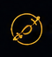
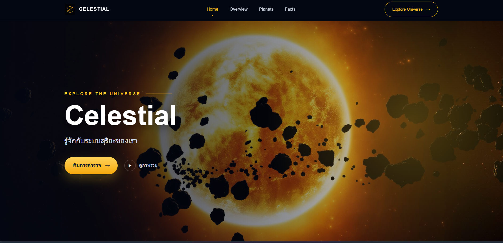

<p align="center">
  
</p>

<h1 align="center">Celestial</h1>

<p align="center">
  เว็บ Landing Page เกี่ยวกับระบบสุริยะ สร้างด้วย HTML, CSS และ JavaScript
</p>

Celestial เป็นเว็บ Landing Page สำหรับนำเสนอข้อมูลเกี่ยวกับระบบสุริยะ โดยมีเนื้อหาอธิบายภาพรวมของระบบสุริยะ แนะนำดาวเคราะห์ทั้ง 8 ดวง และรวบรวมข้อเท็จจริงที่เข้าใจง่ายสำหรับผู้เริ่มต้นเรียนรู้เรื่องอวกาศ

## ตัวอย่างหน้าเว็บ



## ภาพรวมโปรเจกต์

โปรเจกต์นี้เป็นงานฝึกพัฒนาเว็บพื้นฐานด้วย HTML, CSS และ JavaScript โดยออกแบบในธีมอวกาศ ใช้พื้นหลังสีเข้ม สีเหลืองเป็นสีหลักสำหรับจุดเน้น รูปภาพดาวเคราะห์ และการโต้ตอบเล็ก ๆ เพื่อให้หน้าเว็บดูน่าสนใจและใช้งานง่ายขึ้น

## ส่วนหลักของเว็บไซต์

- ส่วน Hero สำหรับแนะนำเว็บไซต์
- ส่วนอธิบายว่าระบบสุริยะคืออะไร
- ส่วนแนะนำดาวเคราะห์แต่ละดวง
- ส่วนข้อเท็จจริงเกี่ยวกับระบบสุริยะ
- ส่วน Footer สำหรับข้อมูลท้ายหน้า

## ฟีเจอร์

- รองรับการแสดงผลทั้งหน้าจอคอมพิวเตอร์ แท็บเล็ต และมือถือ
- แถบนำทางแบบ Sticky Navigation
- เมนูนำทางเปลี่ยนสถานะตาม section ที่กำลังอ่าน
- เมนูย่อยสำหรับเลือกไปยังดาวเคราะห์แต่ละดวง
- Animation แสดงเนื้อหาเมื่อเลื่อนถึง
- ปุ่มกลับขึ้นด้านบน
- เมนูสำหรับหน้าจอมือถือ

## เทคโนโลยีที่ใช้

- HTML สำหรับโครงสร้างหน้าเว็บ
- CSS สำหรับจัด layout สี ตัวอักษร และ responsive design
- JavaScript สำหรับการทำงานของเมนู animation และการเลื่อนหน้า

## โครงสร้างโฟลเดอร์

```text
mysite/
  assets/
    image.png
    logo.png
    solarsystem.jpg
    sun.jpg
  css/
    global.css
  javascript/
    main.js
  index.html
```

## จุดประสงค์ของโปรเจกต์

โปรเจกต์นี้สร้างขึ้นเพื่อฝึกทำ Landing Page ตั้งแต่การวางโครงสร้าง HTML การจัดสไตล์ด้วย CSS การออกแบบ responsive layout และการเพิ่ม JavaScript เพื่อให้หน้าเว็บมีการโต้ตอบที่ดีขึ้น
